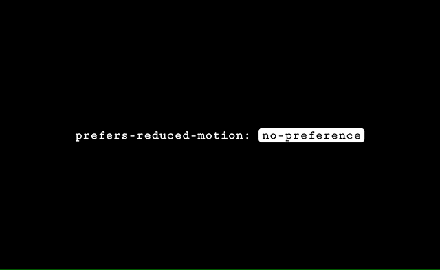

# Detect Prefers Reduced Motion 🐛️ 🔍️ 👀️

> A micro ES6 module (~0.5KB) for detecting a users `prefers-reduced-motion` and watching for changes.

[](#)
[](#)
[](#)
[](#)
[](https://opensource.org/licenses/MIT)

## Installation

```js
npm install @egstad/detect-motion
```

## Usage

```js
import detectMotion from '@egstad/detect-motion'

// watch for `reducedMotionUpdated` events
window.addEventListener('reducedMotionUpdated', (e) => {
  // `e.detail.reduce` returns a boolean
  if (e.detail.reduce) {
    // remove animations here if
  } else {
    // add animations here
  }
})

// 1. fetch current motion preference
// 2. dispatch result via 'reducedMotionUpdated'
// 3. watch for changes
detectMotion.watch()
```

## Methods 

The `watch()` method is more than likely all you'll need. Here's a list of what each method in the module does.

```js
// 1. fetch preferred theme
// 2. dispatch result via 'reducedMotionUpdated'
detectMotion.get()

// 1. runs `get()`
// 2. adds `reducedMotionUpdated` event listener to window
detectMotion.watch()

// removes `reducedMotionUpdated` event listener from window
detectMotion.destroy()
```

## Example

Here is a screencap demonstrating the realtime updates on Mac OS *(System Preferences > Accessibility > Display > Reduce Motion)*.


